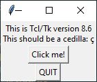

# now_and_next

_Status: in development_

For executives with executive dysfunction / ADHD etc., who are using windows and Outlook.

I'm undiagnosed, but this chimes: https://www.youtube.com/watch?v=_tpB-B8BXk0#t=4m30s

Now that I've put everything in my calendar, the problem is getting my head out of my current work to go look at the calendar and notice the next meeting coming.

This program's a crutch for that: An always-on-top timer display until your next Outlook appointment along with a summary of what Outlook meeting(s) are currently ongoing and what meeting is next.

# Instructions

## Prerequisites

* python3 on windows
* Outlook
* tkinter. This should come with your python installation, try: `python -m tkinter`.  If it's working, you'll see this:

## Installation

Just clone the repo or download now_and_next.py someplace to your taste.
## Operation

To use it, start outlook, then `python now_and_next.py` to start this program.  

Don't minimize it, it defeats the point :-)
