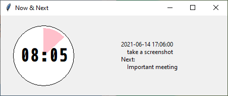

# now_and_next

Put time in your visual field so that you are not perpetually late for meetings.

Keywords: Time-blindness, ADHD, executive dysfunction, neurodiversity.

Status: *basically working*, accepting pull requests.

## Purpose

*as a* person with time-blindness who has to mix appointments and other work
*I want* to be constantly reminded how ling it is until my next appointment
*so that* I can manage my work and show up to meetings on time.

As my job role changed from one with a lot of deep work to one with a lot of appointments it's become necessary to plan my time carefully using the calendar.  The problem now is getting my head out of my current work even to go look at the calendar and notice the next meeting coming.

Time-blindness is an ingredient of ADHD, which is explained well in the following video.  I've linked it with the timestamp to some of the ways you can workaround your own executive dysfunction.  https://www.youtube.com/watch?v=_tpB-B8BXk0#t=4m30s 

## Instructions

### Prerequisites

* python3 on windows
* Outlook
* tkinter. This should come with your python installation, try: `python -m tkinter`.  If it's working, you'll see this:

### Installation

Just clone the repo or download now_and_next.py someplace to your taste.

### Operation

To use it, start outlook, then `python now_and_next.py` to start this program.  

Don't minimize it, it defeats the point :-)
